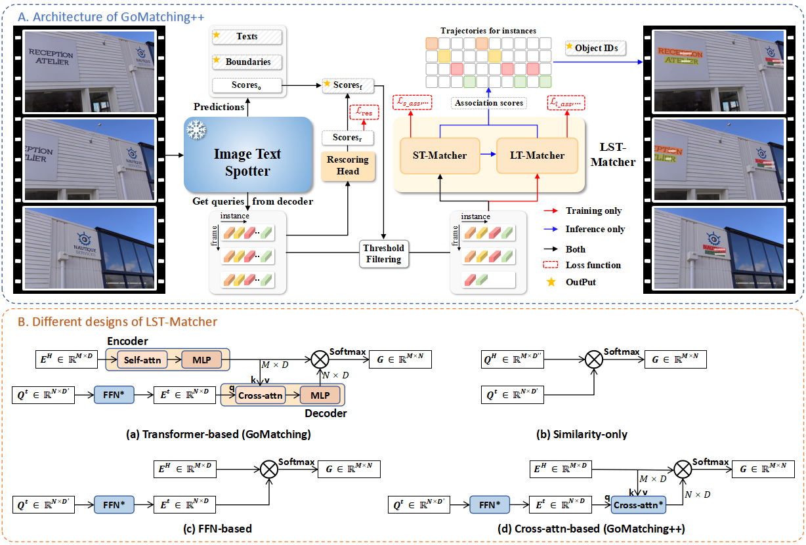

<h1 align="center"> GoMatching: A Simple Baseline for Video Text Spotting via Long and Short Term Matching<a href="https://arxiv.org/abs/2401.07080">"></a> </h1>
<p align="center">
<h4 align="center">This is the official repository of the paper <a href="https://arxiv.org/abs/2401.07080">GoMatching: A Simple Baseline for Video Text Spotting via Long and Short Term Matching</a>.</h4>
<h5 align="center"><em>Haibin He, Maoyuan Ye, Jing Zhang, Juhua Liu, Dacheng Tao</em></h5>
<p align="center">
  <a href="#introduction">Introduction</a> |
  <a href="#news">News</a> |
  <a href="#usage">Usage</a> |
  <a href="#main results">Main Results</a> |
  <a href="#statement">Statement</a>
</p>


# Introduction
<figure>

</figure>

1. We identify a main bottleneck in the state-of-the-art video text spotter: the limited recognition capability. In response to this issue, we propose to efficiently turn an off-the-shelf query-based image text spotter into a specialist on video and present a simple baseline termed GoMatching.
2. We introduce a rescoring mechanism and long-short term matching module to adapt image text spotter to video datasets and enhance the tracker's capabilities.
3. We establish the ArTVideo test set for addressing the absence of curved texts in current video text spotting datasets and evaluating the performance of video text spotters on videos with arbitrary-shaped text. ArTVideo contains 20 video clips, featuring 30% curved text approximately.
4. GoMatching only requires 3 hours training on one Nvidia RTX 3090 GPU for ICDAR15-video. For video text spotting task, GoMatching achieves 70.52 MOTA on ICDAR15-video, setting a new record on the leaderboard. We reveal the probability of freezing off-the-shelf ITS part and focusing on tracking, thereby saving training budgets while reaching SOTA performance. 


# News

***13/01/2024***

- The paper is uploaded to arxiv! 


# Usage
The code will be made public available once cleaned up.


# Main Results
**[ICDAR15-video Video Text Spotting challenge](https://rrc.cvc.uab.es/?ch=3&com=evaluation&task=4)**

|   Method   | MOTA  | MOTP  | IDF1  | Weight |
| :--------: | :---: | :---: | :---: | :----: |
| GoMatching | 70.52 | 78.25 | 78.70 |   /    |


**[DSText Video Text Spotting challenge](https://rrc.cvc.uab.es/?ch=22&com=evaluation&task=2)**

|   Method   | MOTA  | MOTP  | IDF1  | Weight |
| :--------: | :---: | :---: | :---: | :----: |
| GoMatching | 17.29 | 77.48 | 45.20 |   /    |


# Statement

This project is for research purpose only. For any other questions please contact [haibinhe@whu.edu.cn](mailto:haibinhe@whu.edu.cn).


## Citation

If you find GoMatching helpful, please consider giving this repo a star and citing:

```bibtex
@article{he2024gomatching,
  title={GoMatching: A Simple Baseline for Video Text Spotting via Long and Short Term Matching},
  author={He, Haibin and Ye, Maoyuan and Zhang, Jing and Liu, Juhua and Tao, Dacheng},
  journal={arXiv preprint arXiv:2401.07080},
  year={2024}
}
```
```bibtex
@inproceedings{ye2023deepsolo,
  title={DeepSolo: Let Transformer Decoder with Explicit Points Solo for Text Spotting},
  author={Ye, Maoyuan and Zhang, Jing and Zhao, Shanshan and Liu, Juhua and Liu, Tongliang and Du, Bo and Tao, Dacheng},
  booktitle={Proceedings of the IEEE/CVF Conference on Computer Vision and Pattern Recognition},
  pages={19348--19357},
  year={2023}
}
```

